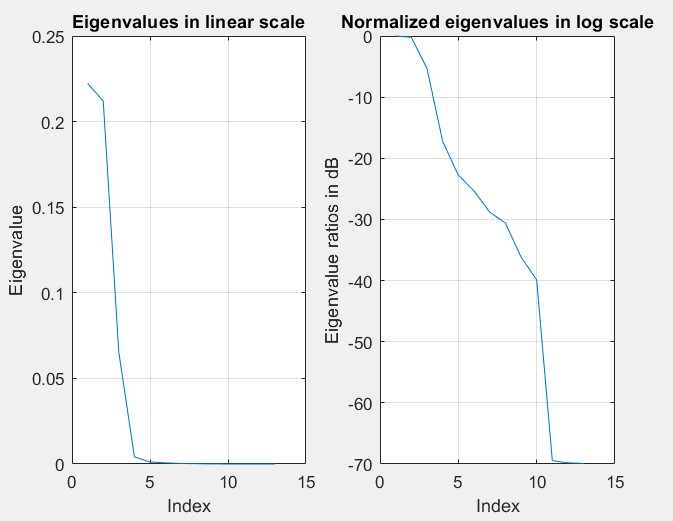

# BSS Lecture Codes
## Reza Sameni
## Emory University Department of Biomedical Informatics

A short lecture of blind-source separation algorithms with practical examples in Matlab
### Student Name: Sina Dabiri
### Student Email: sdabiri@emory.edu
***
### Question 1
#### Part A


#### Part B
The Matlab implementation:
```install
>> C = [[5,1];[1,2]]
>> [vec,val]=eig(C)
vec =
    0.2898   -0.9571
   -0.9571   -0.2898
val =
    1.6972         0
         0    5.3028

```
Note the ratio of 0.9571/0.2898=3.3026 and 0.2898/0.9571=0.30279 are similar to the ratios we got (3.30278, and 0.302776). This is because the results are not unique but their ratio is.

***
### Question 2
#### Part A
```install
>> v0 = rand(2, 1);
>> v20 = EigenAnalysisPowerMethod([[5,1];[1,2]], v0, 20)
v20 =
    0.9571
    0.2898
```
#### Part B
This is an adaptation of Dr. Sameni's EigenAnalysisPowerMethod for N=20:
```install
[n,~] = size(A);
v0 = rand(n,1);

V = zeros(n,N);
v = v0(:); % initial vector

for k = 1 : N
    v = A * v;
    v = v / sqrt(v' * v);
    V(:,k) = v;
end


%% Plotting
figure(1)
% plot(1:N,V(:,1:N))
hold on
for p=1:N
    plot(V(:,p));
    legend();
end
hold off
title('The power method for Eigen');
xlabel('lambda 2');
ylabel('lambda 1');

```
To run we give it an nxn matrix A and the iterations, in this case 20:
```install
>> A = [[5,1];[1,2]]
A =
     5     1
     1     2
>> V = SinaEigenAnalysisPowerMethod(A, N)
V =
    0.9571
    0.2898

```

***
### Question 3
#### Part A
##### Ex01
ECG from Physionet PTB database patient1 record s0014lre (channel 1 to 14) was used. The eigen vectors and values are: 
```install
>> [V, D] = eig(Cx, 'vector')
V =
  Columns 1 through 12
   -0.0172   -0.0381    0.7475    0.0185   -0.0876   -0.0815    0.0639   -0.3570    0.0897   -0.3781    0.1812    0.1170
   -0.0627   -0.7146   -0.2143    0.0117   -0.0839   -0.1359   -0.0604   -0.1931   -0.1407    0.1745   -0.2256    0.0630
   -0.5862    0.0282    0.4878   -0.0126    0.0458    0.0136   -0.0940    0.2605   -0.1600    0.4654   -0.2939   -0.0855
   -0.6165   -0.4228   -0.1533   -0.0025    0.0400    0.0951    0.0923    0.0146    0.1855   -0.3635    0.3161   -0.0045
   -0.5216    0.5553   -0.3659    0.0152   -0.0858   -0.1087    0.0018   -0.2751   -0.0255   -0.1018   -0.0222    0.0900
   -0.0000   -0.0000    0.0000    0.0330   -0.1667   -0.0823    0.1262    0.2042    0.4687   -0.3623   -0.7387    0.0910
   -0.0000    0.0001    0.0000   -0.3248    0.0302    0.3643   -0.5235   -0.4830    0.1582    0.1156   -0.1846    0.3432
    0.0000   -0.0001   -0.0000    0.5462    0.1441   -0.3347   -0.1667    0.0171   -0.3262   -0.1018   -0.0638    0.5998
   -0.0000    0.0000    0.0000   -0.5743   -0.1328    0.0129    0.5194    0.1296   -0.2972    0.0171   -0.0023    0.5243
    0.0000   -0.0000   -0.0001    0.4208    0.0780    0.5793    0.3098    0.0818    0.3389    0.2827    0.1179    0.3433
    0.0000    0.0000   -0.0000   -0.2840    0.6440   -0.3541   -0.1527    0.2484    0.4129    0.0752    0.1613    0.2033
   -0.0000    0.0000    0.0001   -0.0256   -0.6964   -0.2297   -0.3163    0.2938    0.2960    0.1946    0.3250    0.2076
   -0.0000    0.0000   -0.0000   -0.0778    0.0366    0.4341   -0.4099    0.4947   -0.3147   -0.4344    0.0097    0.0616
  Column 13
    0.3095
    0.5176
   -0.0507
   -0.3628
    0.4135
   -0.0419
   -0.2515
   -0.2452
   -0.0475
    0.2283
    0.2252
    0.0314
    0.3160
D =
    0.0000
    0.0000
    0.0000
    0.0000
    0.0001
    0.0002
    0.0003
    0.0006
    0.0012
    0.0042
    0.0653
    0.2121
    0.2223
```


##### Ex02

***
